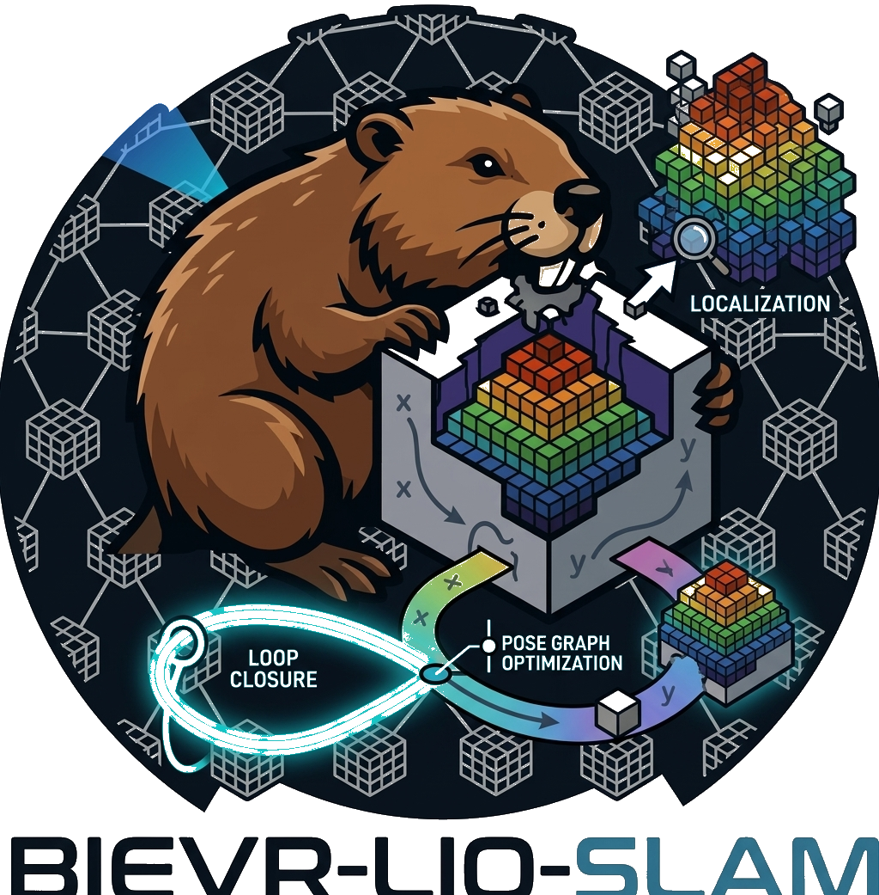
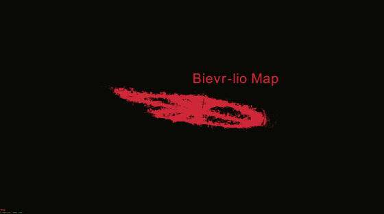
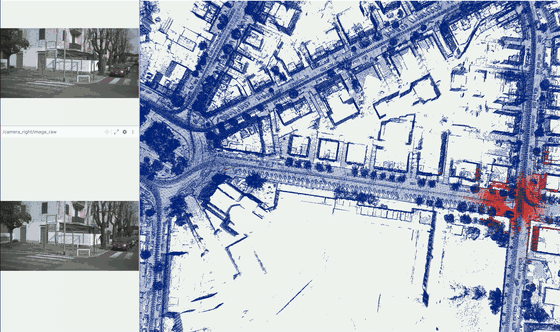
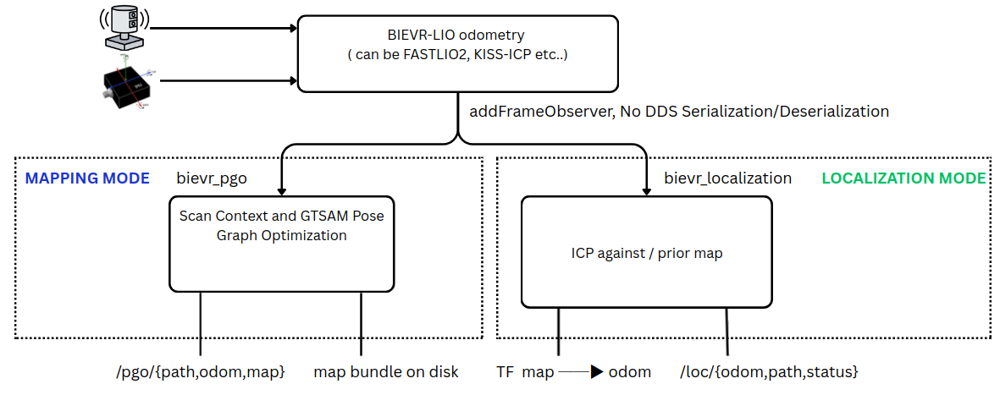

<p align="center">
  
</p>

# BIEVR-LIO-SLAM: SLAM and Global Localization on top of BIEVR-LIO

<p align="center">
<a href="https://github.com/patripfr/lio"></a>
<a href="https://docs.ros.org/en/jazzy/"></a>
<a href="#installation"></a>
</p>

<p align="center">
  <b>BIEVR odometry-only map &nbsp;vs&nbsp; BIEVR-LIO-SLAM map</b>
</p>
<p align="center">
  
</p>

<p align="center">
  <b>Localization on a pre-built map</b>
</p>
<p align="center">
  
</p>

BIEVR-LIO is a robust LiDAR-Inertial **Odometry** framework that uses a
high-resolution, voxel-wise oriented height image map to exploit subtle geometric
variations in challenging, information-sparse environments.

**This repository extends it into a full SLAM and localization system.** Odometry
alone drifts: it has no memory of having been somewhere before, and no notion of a
map that outlives the run. Added here, as modules that sit *downstream* of the
odometry:

- **Loop closure with pose-graph optimization** — Scan Context place recognition
  feeding a GTSAM pose graph, so revisits pull the trajectory back into shape.
- **Global localization against a prior map** — relocalize automatically from Scan
  Context descriptors, or against any bare `.pcd` from any SLAM by clicking a pose
  in RViz.
- **Two modes, two launch files** — [mapping](#mapping-mode) builds and saves a map
  bundle; [localization](#localization-mode) tracks a map that already exists.

## The extension is downstream, and that is the point

None of this touches the odometry. Every module hangs off a single observer hook,
`Pipeline::addFrameObserver`, which hands out `(stamp, pose, undistorted cloud)`
after each frame is published. Corrections are published alongside the odometry and
are **never fed back into it**, so the odometry behaves identically whether these
modules run or not.

<p align="center">
  
</p>

The consequence worth stating plainly: **this is portable to any LOAM-like LIO.**
Nothing in `bievr_scancontext`, `bievr_pgo`, `bievr_map_io` or `bievr_localization`
knows what produced the poses it is given. Porting to FAST-LIO, LIO-SAM, KISS-ICP or
anything else means supplying the same three things from that odometry's per-frame
callback — a stamp, a body pose in the odometry frame, and the undistorted cloud in
the body frame — and giving the module a place to run. There is no shared state, no
callback into the estimator, and no assumption about the map representation.

<details>
<summary><b>About the odometry</b></summary>
<br>
Reliable odometry is essential for mobile robots as they increasingly enter more challenging environments, which often contain little information to constrain point cloud registration, resulting in degraded LiDAR–Inertial Odometry (LIO) accuracy or even divergence. To address this, we present BIEVR-LIO, a novel approach designed specifically to exploit subtle variations in the available geometry for improved robustness. We propose a high-resolution map representation that stores surfaces as voxel-wise oriented height images. This representation can directly be used for registration without the calculation of intermediate geometric primitives while still supporting efficient updates. Since informative geometry is often sparsely distributed in the environment, we further propose a map-informed point sampling strategy to focus registration on geometrically informative regions, improving robustness in uninformative environments while reducing computational cost compared to global high-resolution sampling. Experiments across multiple sensors, platforms, and environments demonstrate state-of-the-art performance in well-constrained scenes and substantial improvements in challenging scenarios where baseline methods diverge. Additionally, we demonstrate that the fine-grained geometry captured by BIEVR-LIO can be used for downstream tasks such as elevation mapping for robot locomotion.
</details>

# Features

## Loop closure with pose-graph optimization

`modules/scancontext` + `modules/pgo`, enabled by `loop_closure.enable`.

Keyframes are gated by distance and rotation (`keyframe_meter_gap`,
`keyframe_deg_gap`). Each one gets a **Scan Context** descriptor — a polar
ring/sector image of the scan that is rotation-invariant by construction, so a
place is recognized regardless of which way the robot was facing. Candidate loops
are verified by ICP against a submap stacked from the neighbouring keyframes, and
accepted constraints go into a **GTSAM** pose graph optimized incrementally with
iSAM2. Robust Cauchy noise on loop factors keeps a single bad match from wrecking
the graph.

Published on `bievr_lio/pgo/path`, `/pgo/odom` and `/pgo/map`; written to disk as a
**map bundle** by the `~/save_map_bundle` service.

> The descriptor `sc_lidar_height` matters more than it looks: it is added to every
> point's `z` and must *exceed* the depth of the lowest surface below the sensor.
> Set it too small and ground bins go negative, colliding with the `0` that marks an
> empty bin, which quietly degrades matching.

## Global localization with Scan Context descriptors

`modules/localization`, enabled by `localization.enable`, when the prior map is a
**map bundle**.

The bundle carries `scan_context.bin` alongside the poses it is indexed by, so the
first live scan can be matched against every keyframe in the map and turned
straight into a pose. No operator input, no initial guess — the robot works out
where it is on its own, then ICP takes over as the tracker.

## Global localization on a pre-built PCD, via initial-pose estimation

The same module, when the prior map is a bare `.pcd`.

**A prior map is a point cloud. Everything else is an optional accelerator.** Point
`localization.map_path` at a `.pcd` from *any* SLAM and it works: the module loads
it, waits at `WAITING_FOR_POSE`, and takes its seed from RViz's **2D Pose Estimate**
on `/initialpose`. Scan Context descriptors cannot be derived from a merged global
cloud — they are sensor-centric keyframe scans — so a foreign map simply degrades to
manual seeding with a log line, never an error. A bundle directory missing or
disagreeing with its descriptor/pose pair degrades the same way.

Tracking follows [FAST_LIO_LOCALIZATION](https://github.com/HViktorTsoi/FAST_LIO_LOCALIZATION):
ICP runs with the scan already in the `odom` frame against the map-frame prior, so
its output *is* `T_map_odom` directly — no pose composition, and the previous
correction seeds the next. The result is broadcast as TF `map → odom`, composed with
the live odometry, so the full chain is `map → odom → imu`.

## Prior maps that do not fit in RAM

Large prior maps are cached as **tiles** beside the source cloud
(`<cloud>.pcd.tiles/`) and only the ring around the current fix is held in memory.
The cache is built once, keyed on the source file and the parameters that produced
it, and the ICP target plus its KD-tree are rebuilt only when a tile is actually
paged in or out. On a 78M-point, 1 km² map this turns startup from a 900 MB read
into a 2 s index load.

# Modes

Both modes drive the same `process_topics` executable. **The mode is the launch
file, not a switch inside the pipeline** — each one enables its own module and
disables the other, so whatever `params.yaml` says, mapping maps and localization
localizes.

## Mapping mode

```bash
ros2 launch bievr_lio_ros2 mapping.launch.py \
    sensor_config:=<sensor_config> bundle:=/path/to/my_map_bundle
```

Runs the odometry with Scan Context loop closure and pose-graph optimization. When
the run is done, write the map out:

```bash
ros2 service call /bievr_lio_mapping_node/save_map_bundle std_srvs/srv/Trigger
```

That produces a **map bundle** directory — which is exactly what localization mode
consumes:

| File | Purpose |
|------|---------|
| `cloud.pcd` | the loop-closed point cloud; the only file localization strictly needs |
| `scan_context.bin` | keyframe descriptors, what enables automatic relocalization |
| `poses_tum.txt` | the keyframe poses those descriptors are indexed by |
| `meta.yaml` | frame, keyframe filter size, descriptor geometry |

**Saving the pure-odometry (drifted) map.** `save_map_bundle` writes the loop-closed
map from `bievr_pgo`. Independently of loop closure, `bievr_lio` itself accumulates
the raw registered scans (`map_save.accumulate`, on by default) and can write that
map — drift and all, no pose-graph correction applied — on its own:

```bash
ros2 service call /bievr_lio_mapping_node/save_map_drifted std_srvs/srv/Trigger
```

Written to `map_save.path` in `params.yaml` (default `bievr_map.pcd`), voxelized at
`map_save.resolution_m`. Useful to inspect what the odometry alone produced, or on a
run with `loop_closure.enable: false` where `save_map_bundle` isn't available.

## Localization mode

```bash
ros2 launch bievr_lio_ros2 localization.launch.py \
    sensor_config:=<sensor_config> map:=/path/to/my_map_bundle
```

`map:=` takes a bundle directory (relocalizes by itself) **or** a bare `.pcd` from
any SLAM (waits for a 2D Pose Estimate in RViz or Foxglove, or.. maybe plotjuggler(? not sure though)). Watch `/bievr_lio/loc/status`,
which reports `NO_MAP`, `WAITING_FOR_POSE`, `LOCALIZED` or `LOST`.

Until there is a fix, **no TF is broadcast at all** — an absent transform is more
honest than a fake identity that puts the robot at the map origin.

# Roadmap

- [ ] **Smoothing the localization correction.** `map → odom` is currently a step
      function: each accepted ICP result replaces the last one outright, exactly as
      in FAST_LIO_LOCALIZATION. Visible as a small jump at the correction rate.
      Interpolating the correction between cycles would make the fused pose
      continuous without touching the odometry.
- [x] **GPS altitude constraints in the pose graph, to kill Z drift.**
- [ ] Recovery from `LOST` on a cloud-only map, plus an `initial_pose` in YAML and a
      yaw sweep so a map without descriptors can seed itself.
- [ ] A teach pass that lets a foreign `.pcd` earn a descriptor database from a
      good localized run, instead of never having one ( maybe a very nice feature to have ).

# Setup

The core estimator (`bievr_lio`) is a self-contained, ROS-independent library. On
top of it we provide both a **ROS1** interface (`bievr_lio_ros`) and a **ROS2**
interface (`bievr_lio_ros2`), which live side by side under `interfaces/`. The SLAM
and localization modules are separate plain-CMake packages under `modules/`:

| Package | Needs | Used by |
|---------|-------|---------|
| `bievr_scancontext` | Eigen only | both modes |
| `bievr_map_io` | PCL | both modes |
| `bievr_pgo` | GTSAM, PCL | mapping only |
| `bievr_localization` | PCL | localization only |

**They are optional at build time.** `bievr_lio_ros2` finds them with
`find_package(... QUIET)`; if they are absent it builds and runs exactly as the
pure odometry, and the corresponding config sections simply cannot be enabled.
The core keeps its Eigen/Ceres/TBB dependency set untouched — GTSAM and PCL live in
`modules/` and nowhere else.

## Installation

### Dependencies

The core estimator is intentionally light: it only needs
**[Eigen](https://eigen.tuxfamily.org)** and **[Ceres](http://ceres-solver.org)**.

The SLAM modules add **[GTSAM](https://gtsam.org) 4.2** (built and installed to
`/usr/local`), **[PCL](https://pointclouds.org)**, `yaml-cpp` and, for the ROS2
wrapper, `pcl_conversions`:

```bash
sudo apt install libpcl-dev libyaml-cpp-dev ros-jazzy-pcl-conversions
```

Build instructions for both ROS versions are below. Each also offers an optional
Docker image for quickly trying out the system without setting up dependencies.

<details>
<summary><b>ROS1 — pure odometry only, extension not ported</b></summary>
<br>

> [!IMPORTANT]
> **The SLAM and localization extension is ROS2 only.** The modules under
> `modules/` are plain CMake and carry no ROS dependency, so nothing prevents a
> ROS1 wrapper — but the adapters that wire them to a node (`loop_closure.h`,
> `localization.h`, the launch files, the RViz configs) exist under
> `interfaces/ros2` and have **no ROS1 counterpart**. The ROS1 build below still
> gives you the original BIEVR-LIO odometry, unchanged and working. It has **not
> been re-tested** since the extension landed.

### For quick testing: Docker

If you just want to try the system out without setting up dependencies, build the
image and drop into a shell inside it:

```bash
cd docker/
./run_docker_ros1.sh -b
```

The `-b` flag builds the image. On subsequent runs you can
omit it to reuse the existing image. Your `~/data` folder is mounted to
`/home/bievr/data` inside the container so you can keep datasets outside the
image.

To open another terminal inside the running container (e.g. to launch a node
and play a bag):

```bash
docker exec -it BIEVR-LIO-ROS1 /bin/bash
```

### Build

Requires [ROS Noetic](https://wiki.ros.org/noetic/Installation/Ubuntu) and
`python3-catkin-tools` (`sudo apt install python3-catkin-tools`).

Create a catkin workspace and clone BIEVR-LIO into it:

```bash
mkdir -p ~/catkin_ws/src
cd ~/catkin_ws
catkin init
catkin config --extend /opt/ros/noetic
catkin config --cmake-args -DCMAKE_BUILD_TYPE=Release
catkin config --merge-devel

cd ~/catkin_ws/src
git clone git@github.com:patripfr/lio.git BIEVR-LIO
```

Install the Ceres version used by BIEVR-LIO with the provided script (builds
Ceres 2.2.0 from source):

```bash
./BIEVR-LIO/docker/scripts/install_ceres.sh
```

(Optional) **Livox support.** The Livox `CustomMsg` branches are only compiled if
the corresponding driver is found in the workspace at build time. Otherwise
BIEVR-LIO builds fine without them. If you need to process Livox data, clone and
build the matching driver into `~/catkin_ws/src` *before* building BIEVR-LIO
(each driver also needs its Livox-SDK installed system-wide):

- Livox gen1 (`livox_ros_driver`, enables `BIEVR_WITH_LIVOX`):
  [livox_ros_driver](https://github.com/Livox-SDK/livox_ros_driver) +
  [Livox-SDK](https://github.com/Livox-SDK/Livox-SDK)
- Livox gen2 (`livox_ros_driver2`, enables `BIEVR_WITH_LIVOX2`):
  [livox_ros_driver2](https://github.com/Livox-SDK/livox_ros_driver2) +
  [Livox-SDK2](https://github.com/Livox-SDK/Livox-SDK2)

Build and source it:

```bash
cd ~/catkin_ws
catkin build bievr_lio_ros
source devel/setup.bash
```
</details>

<details>
<summary><b>ROS2</b></summary>
<br>

### For quick testing: Docker

If you just want to try the system out without setting up dependencies, build the
image and drop into a shell inside it:

```bash
cd docker/
./run_docker_ros2.sh -b
```

The `-b` flag builds the image. On subsequent runs you can
omit it to reuse the existing image. Your `~/data` folder is mounted to
`/home/bievr/data` inside the container.

To open another terminal inside the running container (e.g. to launch a node
and play a bag):

```bash
docker exec -it BIEVR-LIO-ROS2 /bin/bash
```

### Build

Requires [ROS2 Jazzy](https://docs.ros.org/en/jazzy/Installation.html) and
`python3-colcon-common-extensions`
(`sudo apt install python3-colcon-common-extensions`). The system was tested on
Jazzy, but other ROS2 distributions might also work.

Create a colcon workspace and clone BIEVR-LIO into it:

```bash
mkdir -p ~/colcon_ws/src
cd ~/colcon_ws/src
git clone git@github.com:patripfr/lio.git BIEVR-LIO
```

Install the Ceres version used by BIEVR-LIO with the provided script (builds
Ceres 2.2.0 from source):

```bash
./BIEVR-LIO/docker/scripts/install_ceres.sh
```

(Optional) **Livox support.** The Livox `CustomMsg` branch is only compiled if
`livox_ros_driver2` is found in the workspace at build time. Otherwise BIEVR-LIO
builds fine without it. If you need to process Livox data, clone and build the
driver into `~/colcon_ws/src` *before* building BIEVR-LIO (it also needs its
Livox-SDK2 installed system-wide). Only gen2 exists for ROS2 (enables
`BIEVR_WITH_LIVOX`):

- [livox_ros_driver2](https://github.com/Livox-SDK/livox_ros_driver2) +
  [Livox-SDK2](https://github.com/Livox-SDK/Livox-SDK2)

**GTSAM** is needed for loop closure. `modules/pgo/cmake/FindGTSAM.cmake` finds an
existing install first; if none is found anywhere on `CMAKE_PREFIX_PATH`, it clones
[4.2.0](https://github.com/borglab/gtsam/releases) and builds it automatically
(`GTSAM_USE_SYSTEM_EIGEN=ON` — GTSAM's bundled Eigen would not match the one the
estimator uses) into a per-user cache (`~/.cache/bievr-thirdparty/gtsam-4.2.0` by
default, no `sudo` needed) the first time `bievr_pgo` is configured. Expect that
first configure step to take several minutes; later builds reuse the cached install.
Override the install location with `-DBIEVR_GTSAM_VENDOR_PREFIX=/usr/local` (e.g. to
share one system-wide install across a Docker image, matching how Ceres is baked in).

Build and source it (from the workspace root, so colcon picks up `BIEVR/` — the
core — plus `modules/` and `interfaces/ros2`). `--packages-up-to` pulls the SLAM
modules in, since `bievr_lio_ros2` declares them in its `package.xml`:

```bash
cd ~/colcon_ws
source /opt/ros/jazzy/setup.bash
colcon build --packages-up-to bievr_lio_ros2 --cmake-args -DCMAKE_BUILD_TYPE=Release
source install/setup.bash
```

Watch the configure output to confirm the extension is in:

```
bievr_lio_ros2: bievr_pgo found, loop closure available.
bievr_lio_ros2: bievr_localization found, localization available.
```

To build the odometry alone, `colcon build --packages-up-to bievr_lio_ros2
--packages-skip bievr_pgo bievr_localization` — it will report both as NOT found
and build without them.
</details>

## Run data

BIEVR-LIO provides two entry points, available for both ROS versions:

- **`process_topics`** runs online: it subscribes to the LiDAR and IMU topics and
  processes messages as they arrive. Use it with a live sensor or alongside
  `rosbag play`.
- **`process_bag`** reads a recorded bag directly and pushes its messages through
  the pipeline as fast as they can be processed (no real-time playback). This is the preferred choice for offline evaluation and reproducing results.

In the commands below, replace `<sensor_config>` with one of the provided configs
(see [Configuration](#configuration)) or your own. Add `rviz:=true` to bring up
the visualization.

<details>
<summary><b>ROS1</b></summary>
<br>

Process live topics:

```bash
roslaunch bievr_lio_ros process_topics.launch sensor_config:=<sensor_config>
```

Replay a rosbag:

```bash
roslaunch bievr_lio_ros process_bag.launch sensor_config:=<sensor_config> rosbag:=/path/to/bag.bag
```
</details>

<details>
<summary><b>ROS2</b></summary>
<br>

There are four launch files. The first two are the original odometry entry points;
the last two are the SLAM modes described in [Modes](#modes).

**Pure odometry.** Whatever `params.yaml` says is what runs, so this is also how
you'd run both extensions at once:

```bash
ros2 launch bievr_lio_ros2 process_topics.launch.py sensor_config:=<sensor_config>
ros2 launch bievr_lio_ros2 process_bag.launch.py sensor_config:=<sensor_config> rosbag:=/path/to/bag_dir
```

**Mapping** — odometry + Scan Context loop closure + pose graph, RViz on by
default:

```bash
ros2 launch bievr_lio_ros2 mapping.launch.py \
    sensor_config:=<sensor_config> bundle:=/path/to/my_map_bundle
```

Then, in another terminal, replay a bag against it and save when done:

```bash
ros2 bag play /path/to/bag_dir
ros2 service call /bievr_lio_mapping_node/save_map_bundle std_srvs/srv/Trigger
```

**Localization** — odometry + tracking of a prior map:

```bash
ros2 launch bievr_lio_ros2 localization.launch.py \
    sensor_config:=<sensor_config> map:=/path/to/my_map_bundle
```

Both accept `params:=<name>`, and `rviz:=false` to skip the visualization. With a
bare `.pcd` as `map:=`, use RViz's **2D Pose Estimate** button to seed it.

| Topic | Type | Mode |
|-------|------|------|
| `/bievr_lio/pgo/path` | `nav_msgs/Path` | mapping — loop-corrected keyframe trajectory |
| `/bievr_lio/pgo/map` | `sensor_msgs/PointCloud2` | mapping — loop-corrected cloud |
| `/bievr_lio/loc/status` | `std_msgs/String` | localization — `NO_MAP` / `WAITING_FOR_POSE` / `LOCALIZED` / `LOST` |
| `/bievr_lio/loc/odom` | `nav_msgs/Odometry` | localization — pose in the `map` frame |
| `/bievr_lio/loc/path` | `nav_msgs/Path` | localization — localized trajectory |
| `/bievr_lio/loc/map` | `sensor_msgs/PointCloud2` | localization — the prior map (latched) |
| TF `map → odom` | | localization — the correction, broadcast only once localized |
</details>

## Configuration

The configuration is split in two files:

- **`config/params.yaml`**: Algorithm parameters (map resolution, sampling,
  optimization, IMU window, ...). These are dataset-independent and **typically do
  not need to be adjusted**: the defaults have been validated across a wide range
  of sensors, platforms, and environments.
- **`config/sensor_configs/<name>.yaml`**: Per-dataset / per-sensor settings:
  the LiDAR and IMU topic names, the LiDAR→IMU extrinsic calibration, and the
  LiDAR min/max range.

Select a sensor config at launch with `sensor_config:=<name>`, which resolves to
`config/sensor_configs/<name>.yaml` (an absolute path starting with `/` is used
verbatim, so configs may also live outside the package). Likewise `params:=<name>`
(default `params`) selects `config/<name>.yaml`.

The extension adds two sections to `params.yaml`, both **off by default** so the
odometry runs exactly as before:

- **`loop_closure:`** — keyframe gating, Scan Context descriptor geometry, the ICP
  loop test, GTSAM noise models, and `bundle_path` (where `save_map_bundle`
  writes). Parsed by `bievr_pgo`.
- **`localization:`** — `map_path`, the map/scan/display voxel leaves, the tile
  cache (`tile_size_m`, `crop_radius_m`), the coarse-to-fine ICP, and the
  relocalization thresholds. Parsed by `bievr_localization`.

You do not normally edit `enable:` in either: the launch files layer a small
generated overlay on top of `params.yaml` (`--params_file` is repeatable and later
files win per leaf), which is what makes the mode a launch-file choice.

> [!NOTE]
> `localization.fitness_threshold` is one value that genuinely needs tuning per
> environment. PCL's `getFitnessScore()` is the **mean squared correspondence
> distance in m²**, not an inlier fraction — thresholds copied from Open3D-based
> pipelines do not carry over.

<details>
<summary><b>Provided datasets</b></summary>
<br>

We provide ready-to-use sensor configs for the following public datasets:

| Config | Dataset |
|--------|---------|
| `enwide` | [ENWIDE](https://projects.asl.ethz.ch/datasets/enwide/) |
| `ncd` | [Newer College Dataset](https://drive.google.com/drive/u/0/folders/1uR476FzjN3PfAiCknVKtuZi3_QfVvSdA) |
| `gamma` | [GEODE](https://thisparticle.github.io/geode) |
| `mars` | [MARS-LVIG](https://mars.hku.hk/dataset.html) |
| `grandtour` | [GrandTour](https://grand-tour.leggedrobotics.com/) |
</details>

<details>
<summary><b>Running on your own data</b></summary>
<br>

To run BIEVR-LIO on a new sensor or dataset, copy one of the provided sensor
configs to `config/sensor_configs/<your_name>.yaml` and adjust:

- `topics.pointcloud` / `topics.imu` : The topic names in your data.
- `calibration` : the `T_IMU_LIDAR` extrinsic (LiDAR → IMU) rotation and
  translation for your setup.
- `lidar.min_range_m` / `lidar.max_range_m` : the usable range of your LiDAR.

The algorithm parameters in `params.yaml` can usually be left at their defaults.
</details>

# Acknowledgements

The SLAM and localization extension stands directly on two open-source projects,
and owes them its core ideas:

- **[SC-LIO-SAM](https://github.com/gisbi-kim/SC-LIO-SAM)** by Giseop Kim — the
  Scan Context descriptor and the shape of the Scan Context + pose-graph loop
  closure back-end that `bievr_scancontext` and `bievr_pgo` are built around.
- **[FAST_LIO_LOCALIZATION](https://github.com/HViktorTsoi/FAST_LIO_LOCALIZATION)**
  by HViktorTsoi — the localization architecture: a prior-map ICP node running
  downstream of an untouched odometry, publishing `map → odom` and never feeding
  the correction back. The trick of aligning the odom-frame scan against the
  map-frame prior so ICP's output *is* `T_map_odom` comes from there.

# Citation

Thanks to the BIEVR-LIO authors for their amazing and robust work.
  ```bibtex
@article{pfreundschuh2026bievr,
  title        = {BIEVR-LIO: Robust LiDAR-Inertial Odometry through Bump-Image-Enhanced Voxel Maps},
  author       = {Pfreundschuh, Patrick and Tuna, Turcan and {Le Gentil}, Cedric and Siegwart, Roland and Cadena, Cesar and Oleynikova, Helen},
  year         = 2026,
  journal      = {Robotics: Science and Systems},
}
  ```
